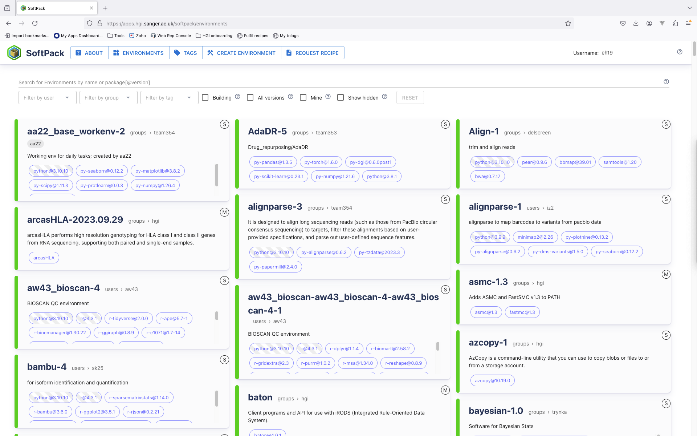
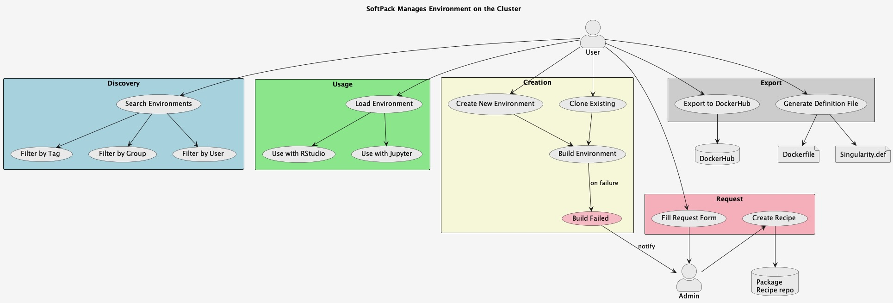

### Discoverability
Softpack provides a nice web interface to overview all the environments created in your team workspace, so that any environments created by any other people in the team will be visible to you, alongside with all the packages that are included. This makes it easy for researchers to reuse existing environments (thus saving time/efforts), and to find the correct owner for instructions.
(draw some nice diagrams on the whiteboard)

### Modularity
similar to conda, users can extend or modify any environments with packages according to their own needs, since each package has its own recipe.

### Reproducibility
The design of Softpack is based on containerisation technology, which makes it easy to export the environment to Docker/Singularity so that it is publicly available (useful for publication).

#### User case 1: Image analysis for super-resolution microscopy using custom software
In this case, multiple people want to run the analysis on a server (powerful computer) where the images are downloaded to. They may want to use different versions of the software due to different needs. 

The custom software will be visible on the interface where each of the visions can be tracked and the explanations given.

Softpack avoids python/software version conflicts, confusion over multiple installations and where to find them etc.

#### User case 2: Put together an analysis pipeline for a manuscript which uses dozens of python and R packages
In this case, the user creates an environment in Softpack that contains all the packages needed for a cluster analysis step of single-molecule localisation data. The analysis is done for a publication manuscript and ideally all the software should be kept as it is (in terms of version, add-on), so that it can be reproduced by readers of the publication.

Softpack provides a quick way to publish the software in a Docker container and upload to DockerHub, without any prior knowledge of Docker.

This avoids complication introduced by software updates, makes hassle-free remote reproduction of the environment possible (instead of dealing with unsuccessful conda installation), in turn promotes reproducible science.
